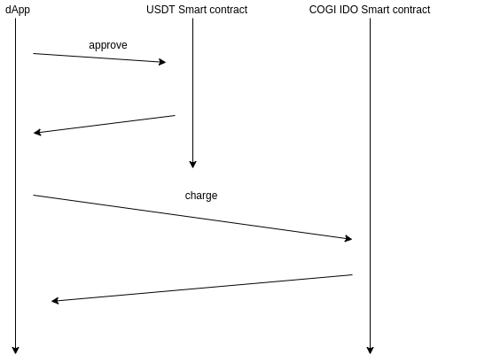

### IDO smartcontract

```bash
charge(uint256 _amount, uint _lockEnd)
#_amount số lượng cần mua
#_lockEnd thời gian khóa token tính bằng ngày
#xem thêm source ido-example
```

### DEMO
[ido-example](http://171.244.21.104/ido-example/)

### Thông tin smartcontract trên testnet Rinkeby
```bash
COGI coin: 0x01964ACC5ff33481AfB03fBEa5690A78eaEE647E
IDO: 0x01964ACC5ff33481AfB03fBEa5690A78eaEE647E
Stablecoin USDT: 0xd9ba894e0097f8cc2bbc9d24d308b98e36dc6d02 
#Thanh khoản Stablecoin USDT tại https://app.uniswap.org/#/swap?outputCurrency=0xd9ba894e0097f8cc2bbc9d24d308b98e36dc6d02&use=V2
```

### Thông tin ABI đây là bản mini, xem abi đầy đủ trong thư mục abi
```json
//USDTERC20.json và KOGIERC20.json
[
  // balanceOf
  {
    "constant":true,
    "inputs":[{"name":"_owner","type":"address"}],
    "name":"balanceOf",
    "outputs":[{"name":"balance","type":"uint256"}],
    "type":"function"
  },
  // decimals
  {
    "constant":true,
    "inputs":[],
    "name":"decimals",
    "outputs":[{"name":"","type":"uint8"}],
    "type":"function"
  },
  //approve
  {
    "constant": false,
    "inputs": [
      {"name": "_spender", "type": "address"},
      {"name": "_value","type": "uint256"}
    ],
    "name": "approve",
    "outputs": [{"name": "","type": "bool"}],
    "payable": false,
    "stateMutability": "nonpayable",
    "type": "function"
  },
]
```

```json
// KOGIERC20IDO.json
  // charge
  {
    "inputs": [
      {"internalType": "uint256","name": "_amount","type": "uint256"},
      {"internalType": "uint256","name": "_lockEnd","type": "uint256"}
    ],
    "name": "charge",
    "outputs": [],
    "stateMutability": "nonpayable",
    "type": "function"
  },
  // getLPBalance
  {
    "constant":true,
    "inputs":[],
    "name":"getLPBalance",
    "outputs":[{"name":"balance","type":"uint256"}],
    "type":"function"
  }
]
```