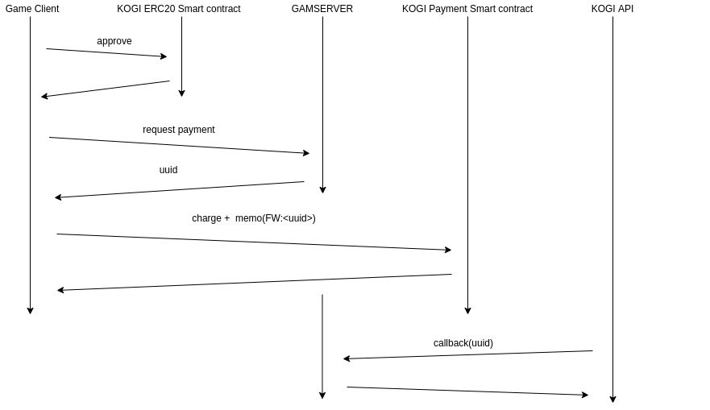

### Payment smartcontract

```bash
charge(uint256 _amount, string memo)
#_amount số lượng cần mua
#memo dùng để chuyển uuid trong bước request payment. Cú pháp FW:<UUID>
#xem thêm source payment-example
```

### DEMO
[payment-example](http://171.244.21.104/payment-example/)

### Thông tin smartcontract trên testnet Rinkeby
```bash
COGI coin: 0x01964ACC5ff33481AfB03fBEa5690A78eaEE647E
Payment Contract: 0xC9e2E30d3C60fe23090A456572f498C64f98ED9e
Địa chỉ cung cấp thanh khoản: 0xC399f98156eCa7A43Fd367C84b193f5BdB4DA2Ef
```